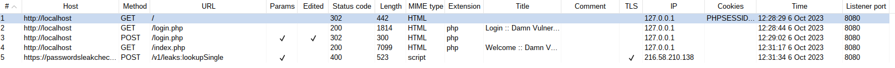
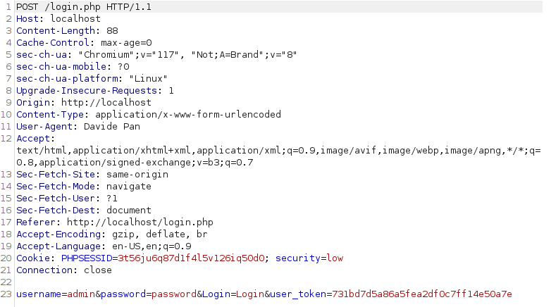
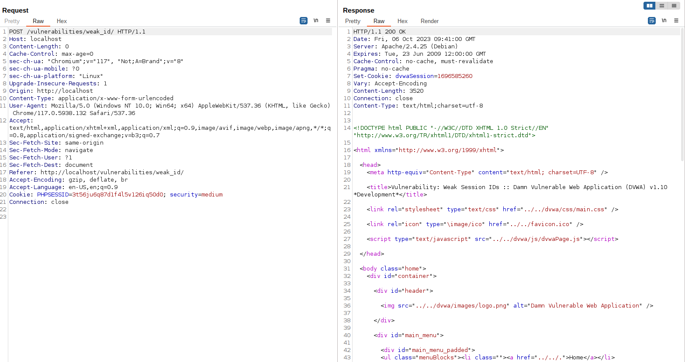
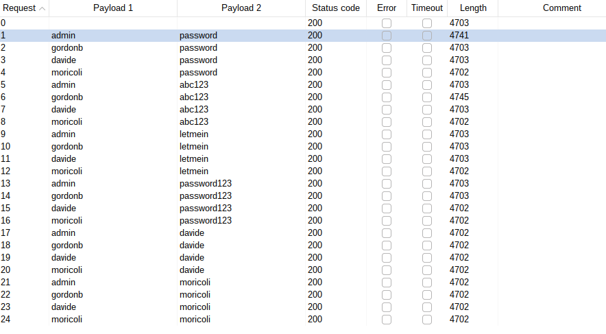
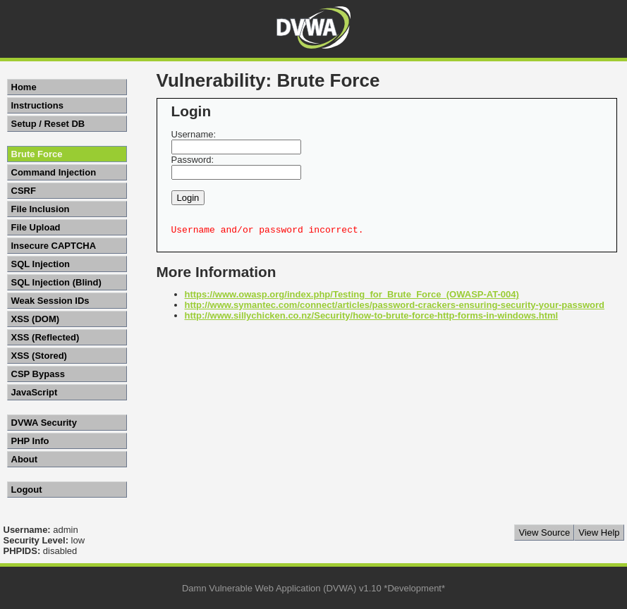
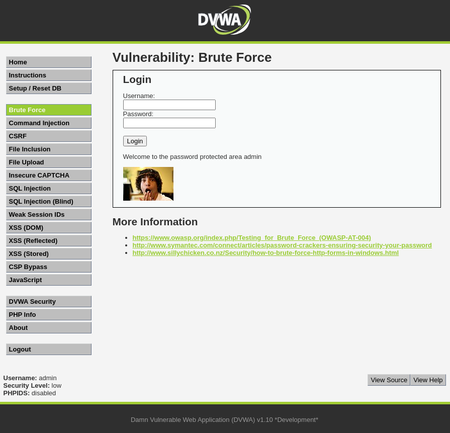
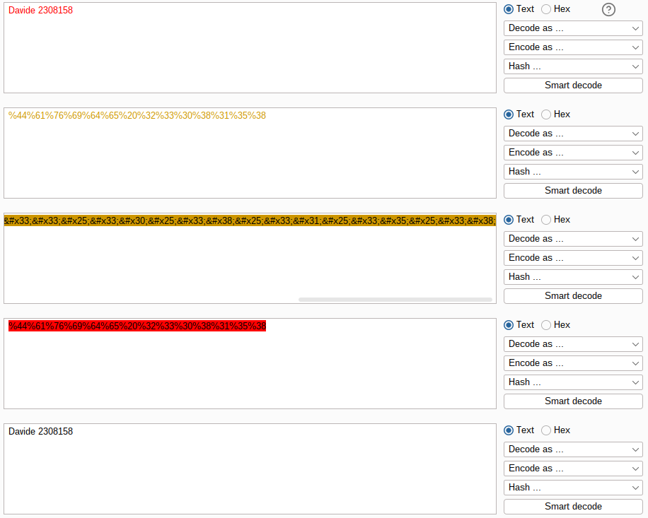
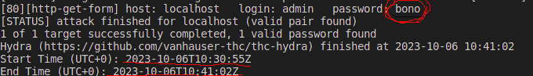
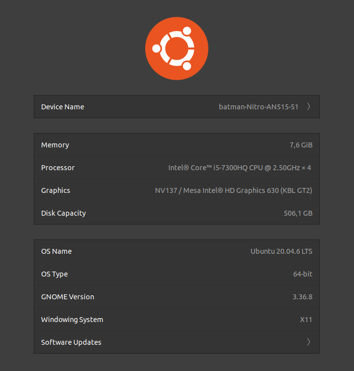

# Week 4

## Task 1: Side-channels

**GPU.zip Side-Channel Attack**

The GPU.zip attack exploit hardware-based graphical data compression in modern GPUs. It targets software-transparent uses of compression, enabling malicious websites to steal sensitive data from concurrently open sites visible on the victim's screen, all without direct device access, rendering it a strong online threat.

**What systems does it affect?** 
GPU.zip represent a significant risk to systems employing modern GPUs with software-transparent compression features. Users accessing the internet through vulnerable web browsers, notably Chrome, are susceptible to this attack. 

**What information is leaked via the side channel?** 
The screenvisible data from the opened websites are collected by this exploit method. The hackers can steal sensitive information through malicious websites by exploiting transparent software compression in modern GPUs. Many websites already have mechanisms in place to prevent such a breach, but users who use web browsers like Google Chrome as the world's most popular browser are still at risk.

**Is there a documented case of it being used in a real life attack?** 
I didn't find any documented real-life instances of GPU.zip attack. This side-channel vulnerability was discovered and detailed by American researchers, highlighting the ongoing evolution of cybersecurity threats. (see [GPU.zip Details](https://www.hertzbleed.com/gpu.zip/GPU-zip.pdf))

**Has it been fixed? If yes, how it was fixed?** 
Despite its potencial, the GPU.zip vulnerability is not fixed yet. There are no reported solutions or patches available, leaving users exposed to potential exploitation.

[GPU Side-channel Attack - SecurityWeek](https://www.securityweek.com/new-gpu-side-channel-attack-allows-malicious-websites-to-steal-data/), [GPU.zip Details](https://www.hertzbleed.com/gpu.zip/GPU-zip.pdf)

## Task 2: Slow Loris

**Slowloris Denial-of-Service Attack:**

**How does it work?** 
Slowloris is a type of Denial-of-Service (DDoS) attack where an attacker sends partial HTTP requests to a targeted web server, keeping many connections to the server open and hold them open as long as possible. By doing so, the attacker consumes all available server resources, such as connection slots and memory, preventing the server from handling legitimate requests.

**Why is it unique while compared to the other high bandwith DDoS attacks?** 
Slowloris is unique because it focuses on exploiting the limitations in web server software rather than overwhelming network bandwidth. It is a low-and-slow attack, maintaining a large number of connections with minimal data, making it hard to detect compared to high-bandwidth DDoS attacks.

**What are the effects of the attack?** 
The attack prevents the targeted web server from serving legitimate users, causing slow loading times or complete unresponsiveness. It can lead to website downtime and financial losses for businesses relying on online services.

**How can you mitigate/prevent the effects of the attack?** 

- **Improve server availability**: increasing the number of clients a server will be able to handle at any time is going to increase the number of connections an attacker has to make before he can overload that server. In reality, even if server capacity is increased, an attacker can increase the number of attacks to overcome server capacity.
- **Rate limit incoming requests**: Restricting access based on certain usage factors will help mitigate a Slowloris attack. All approaches to reducing the effectiveness of low and slow attacks are techniques which make it possible to restrict the number of connections that may be made with one IP address, reduce slower transfer rates or limit the duration of a client's cnnicate.
- **Load Balancers**: Employ load balancers to distribute traffic evenly and detect slow or incomplete requests.
- **Intrusion Prevention Systems (IPS)**: IPS solutions can detect and block Slowloris-style attacks by recognizing the attack patterns.

**Are there any notable instances of this style of attack being performed?** 
Slowloris has been used in various attacks against high-profile websites.
In 2009, during the Iranian president election Slowloris was used as DoS attack against sites run by the Iranian government.
Specific instances might not always be publicly because of the nature of the attacks.

[Slowloris DDoS attack - Cloudflare](https://www.cloudflare.com/learning/ddos/ddos-attack-tools/slowloris/),
[Slowloris (computer security)](https://en.wikipedia.org/wiki/Slowloris_(computer_security))

## Task 3: BurpSuite Introduction

### Subtask 1: Intercepting

### Subtask 2: Repeater

After some requests I find out that the method used to create a new dvwaSession cookie is to take current time and express it in epoch timestamp. 
At the begginning, after 2-3 request I was thinking about an integer increased by a formula or something like that, but after I noticed that the new dvwaSession cookie ends always like the current time in seconds. So I checked other 2-3 requests, I checked also the old requests, and I found out that I was right.

### Subtask 3: Intruder

The bruteforce attempt that was successful is the first one and the sixth one:

        1. Username = admin
           Password = password

        6. Username = gordonb
           Password = abc123

(actually they are the second and the seventh if we count the 0-attempt which is the attempt with blank credentials).

I came with this conclusion because of the response length. I analyzed the responses and I noticed that the length is pretty much the same with every attempt but in those 2 it is different.
For the other requests is about 4702-4703 but the length of those 2 attempts is more, about 4740.

After that, I analyzed the response and the length is more because of the changing of the return message.
One is "Username and/or password incorrect." and one is "Welcome to the password protected area admin".
There are also other changes in the response page, but for me this one is the important one for checking the correct login.

Unsuccess | Success
:-------------------------:|:-------------------------:
 | 

### Subtask 4: Decoder

### Subtask 5: Hydra

For that task I used [**script.sh**](script.sh) to get the times of the following command: 

    docker run --network="host" vanhauser/hydra -V -f -I -l admin -x 1:4:a "http-get-form://localhost/vulnerabilities/brute/:username=^USER^&password=^PASS^&Login=Login:H=Cookie:PHPSESSID=3t56ju6q87d1f4l5v126iq50d0; security=low:F=Username and/or password incorrect."

These are the results:

- Password: bono
- Total time: 10 minutes, and 7 seconds 
- PC spec: 

