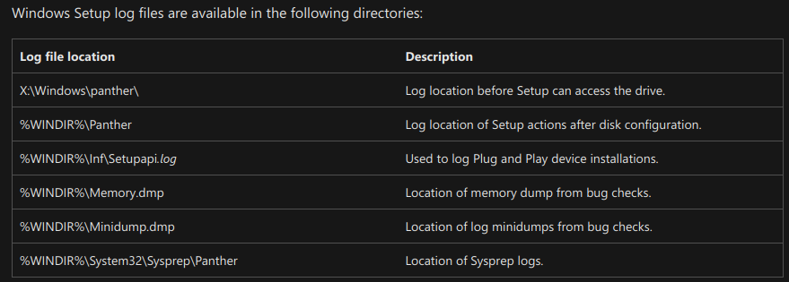
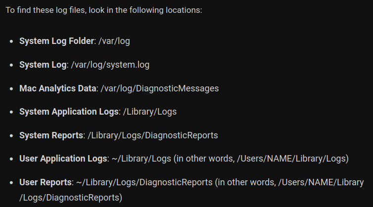

# Week 5

## Task 1: Bring your own devices

*Following link containing NIST:s security recommendations for workplace bring your own device. On the page 12 is listed following 9 threat events, and your job is to make one A4 sized poster or otherwise shortly summarize what each listed threat event means based on the document or your own research.*

Other sources: [nist.gov](https://pages.nist.gov/mobile-threat-catalogue)
| Threat Event  | Description | Source |
|---------------|-------------|--------|
| **Intrusive application practices** | Intrusive application practices involve exploiting Mobile OS APIs to access sensitive data stored in accessible locations or shared through services. Untrusted apps can read or modify this data, compromising confidentiality, integrity, and availability. These apps can also collect persistent identifiers. Combining those the risk of impersonation attacks is increased. Intrusive applications pose severe privacy and security threats, compromising users sensitive data and device integrity. | [APP-2](https://pages.nist.gov/mobile-threat-catalogue/application-threats/APP-2.html),[APP-12](https://pages.nist.gov/mobile-threat-catalogue/application-threats/APP-12.html)
| **Account credential theft through phishing** | Involves attackers tricking users into revealing their login credentials through deceptive means, often leading to unauthorized access to accounts.| [AUT-9](https://pages.nist.gov/mobile-threat-catalogue/authentication-threats/AUT-9.html)
| **Outdated phones** | Outdated phones are vulnerable to serious threats, risking unauthorized access and data manipulation. Malicious apps exploiting privilege escalation in mobile OS, drivers, firmware, or kernel can execute unauthorized actions or gain access to sensitive data. Vulnerabilities in OS services or firmware may enable arbitrary code execution or denial-of-service attacks. Firmware malware and persistent bootkits, operating before the OS loads, can subvert OS components and remain undetected even after reinstallation, emphasizing the severity of these risks on outdated devices. |  [APP-4](https://pages.nist.gov/mobile-threat-catalogue/application-threats/APP-4.html),[APP-26](https://pages.nist.gov/mobile-threat-catalogue/application-threats/APP-26.html),[STA-0](https://pages.nist.gov/mobile-threat-catalogue/stack-threats/STA-0.html),[STA-9](https://pages.nist.gov/mobile-threat-catalogue/stack-threats/STA-9.html),[STA-16](https://pages.nist.gov/mobile-threat-catalogue/stack-threats/STA-16.html),
| **Sensitive data transmissions** |Relates to the insecure transfer of sensitive information over networks, which can be intercepted and accessed by unauthorized entities, leading to potential data breaches. Unencrypted data transmissions from apps or devices create severe vulnerabilities. Phone calls are susceptible to interception too, allowing adversaries to eavesdrop. | [APP-0](https://pages.nist.gov/mobile-threat-catalogue/application-threats/APP-0.html),[CEL-18](https://pages.nist.gov/mobile-threat-catalogue/cellular-threats/CEL-18.html),[LPN-2](https://pages.nist.gov/mobile-threat-catalogue/lan-pan-threats/LPN-2.html)
| **Brute-force attacks to unlock a phone** | Involves attackers systematically trying various password combinations to gain unauthorized access to a locked phone, bypassing security measures through trial and error. Short or easily guessed PINs are vulnerable. Fingerprint and smudge patterns on the screen can reveal parts of the PIN, helping attackers. Such attacks exploit predictable user behavior and weak security measures, allowing unauthorized access to the device. | [AUT-2](https://pages.nist.gov/mobile-threat-catalogue/authentication-threats/AUT-2.html), [AUT-4](https://pages.nist.gov/mobile-threat-catalogue/authentication-threats/AUT-4.html)
| **Application credential storage vulnerability** | Refers to a security flaw where applications store sensitive credentials or information in an insecure manner, making it easier for attackers to access and misuse that data. | [APP-9](https://pages.nist.gov/mobile-threat-catalogue/application-threats/APP-9.html),[AUT-0](https://pages.nist.gov/mobile-threat-catalogue/authentication-threats/AUT-0.html)
| **Unmanaged device protection** | Denotes the lack of security measures and policies for devices within an organization, leading to potential security breaches and unauthorized access to sensitive information. | [EMM-5](https://pages.nist.gov/mobile-threat-catalogue/emm-threats/EMM-5.html)
| **Lost or stolen data protection** | Involves safeguarding data in the event of a lost or stolen device, ensuring that the data remains encrypted or inaccessible to unauthorized users even if the physical device is compromised. | [PHY-0](https://pages.nist.gov/mobile-threat-catalogue/physical-threats/PHY-0.html)
| **Protecting enterprise data from being inadvertently backed up to a cloud service** | *Enterprise data may be synchronized to unmanaged and potentially insecure 3rd party cloud services.* Safeguarding enterprise data from inadvertent cloud backup involves enforcing strict access controls and policies. Robust endpoint security is vital to mitigate the risks associated with accidental data synchronization to insecure third-party cloud platforms. | [EMM-9](https://pages.nist.gov/mobile-threat-catalogue/emm-threats/EMM-9.html)

## Task 2: attacks on CPU execution

*Spectre and meltdown are two original side channel attacks discovered in 2017 that target cpu, and over the years more have been discovered. This wikipedia article list some of them. Pick 3 of them to research about how exactly each exploits the system,their differences, which systems they targeted and how they can be mitigated.*

| ZombieLoad | INCEPTION | Foreshadow |
|---------|----------|------------|
| Targets Intel processors with SMT, exploiting MDS vulnerabilities for data leakage. ZombieLoad infiltrates the processor's internal buffers, allowing the leak of sensitive data across applications. It takes advantage of microarchitectural flaws, accessing data that should be protected. | It focuses on power consumption patterns to infer cryptographic keys. By monitoring energy fluctuations, this attack method extracts sensitive information, revealing cryptographic keys. This process allows unauthorized access to encrypted data, exploiting the processor's power behavior for malicious purposes. | It attacks Intel processors with SGX technology via speculative execution. By compromising SGX enclaves, Foreshadow exposes protected data, breaching security barriers. This attack manipulates speculative execution to access information meant to be secure, making it a critical threat to systems relying on SGX protection. |
| **Intel** processors with SMT enabled. | **AMD** processors. | **Intel** prorcessors with SGX technology enabled. |
| Microcode Updates by Intel, OS patches. Co-Scheduling, Flushing Buffers, Selective Feature Deactivation, Removing Prefetch Gadgets, Instruction Filtering, Secret Sharing. [See also...](https://arxiv.org/pdf/1905.05726.pdf#section.7) | A complete mitigation requires hardware modification The attack surface can be reduced by flushing the branch predictor state on privilege transitions on certain mi-croarchitectures introducing a significant performance penalty [See also...](https://comsec.ethz.ch/wp-content/files/inception_sec23.pdf#section.9) | Microcode Updates by Intel, OS patches. [See also...](https://foreshadowattack.eu/foreshadow.pdf#section.6) | 

## Task 3: Securing OS

**Malware and Viruses**:
 *Harm*: Malware and viruses can corrupt files, steal sensitive data, and disrupt system operations, causing financial loss and privacy breaches.
 *OS Mitigation*: All three OS types provide built-in antivirus software to scan and remove malware (Windows Defender for Windows). Regular updates and cautious downloading also enhance security. There are also valid antiviruses as external application that can enhance security.
 

**Exploiting Software Vulnerabilities**:
 *Harm*: Exploiting vulnerabilities can lead to unauthorized access, system crashes or installation of malicious software, compromising user data and system integrity.
 *OS Mitigation*: Regularly updating the OS and installed applications is crucial. Security features like Windows Defender SmartScreen for Windows also help in blocking suspicious applications.
 

**Phishing and Social Engineering**:
 *Harm*: Phishing attacks trick users into revealing sensitive information, leading to identity theft and unauthorized access.
 *OS Mitigation*: Windows offer built-in phishing filters called Enhanced phishing protection with SmartScreen protecting passwords against phishing and unsafe usage on sites and apps.
 

**Drive-by Downloads**:
 *Harm*: Drive-by downloads silently install malicious software on a user system when visiting a compromised website, leading to malware infections.
 *OS Mitigation*: Windows uses Microsoft Defender SmartScreen to help protect against drive-by attacks. It has also the system Input/Output Memory Management Unit (IOMMU) to block external peripherals from starting and performing DMA Drive By attack.
 

**Zero-Day Exploits**:
 *Harm*: Zero-day exploits target unknown vulnerabilities, potentially causing significant damage before a patch is available.
 *OS Mitigation*: Zero-day exploits are hard to counter. OSs like Windows has Windows Firewall and Windows Defender for mitigating this attack. Keeping up to date these software can help.
 

**USB/Removable Media Attacks**:
 *Harm*: Malware can spread through infected USB drives, compromising connected systems and networks.
 *OS Mitigation*: Disabling autorun features, using antivirus software to scan removable media, and employing endpoint security solutions like Windows Defender Exploit Guard in Windows can prevent automatic malware execution.
 

**Password Cracking**:
 *Harm*: Weak or cracked passwords can lead to unauthorized access, data breaches, and identity theft.
 *OS Mitigation*: OSs encourage strong password policies and often provide tools to enforce them. Additionally, enabling two-factor authentication adds an extra layer of security, making it difficult for attackers to gain unauthorized access.

[Microsoft Defender Smartscreen](https://learn.microsoft.com/en-us/windows/security/operating-system-security/virus-and-threat-protection/microsoft-defender-smartscreen/), 
[Microsoft Defender](https://www.microsoft.com/en-us/windows/comprehensive-security), 
[IoMmu Model](https://learn.microsoft.com/en-us/windows-hardware/drivers/display/iommu-model)

## Task4: Logging
#### 1. What kind of information would be saved into following types of log files: Application, Event, Service and System logs

**Application Logs**: Application logs contain information specific to software applications. This can include errors, warnings, user actions, and performance data related to the application's functioning.   
**Event Logs**: Event logs record events generated by the operating system or applications. They include system events, security events (like login attempts), and application events, providing a comprehensive overview of activities on a system. 
**Service Logs**: Service logs capture information related to system services, such as web servers, databases, or email services. They detail service-specific events, errors, and performance metrics.  
**System Logs**: System logs document system-wide events and errors. This includes kernel activities, hardware issues, and system resource utilization data.

#### 2. Where in each of the common Operating Systems those logs would be stored (Windows, Mac, Linux(changes per distro so provide in answer which you are using))

**Windows**: Logs can be viewed in the Event Viewer and are stored in:  
 https://learn.microsoft.com/en-us/windows-hardware/manufacture/desktop/windows-setup-log-files-and-event-logs?view=windows-11 
**Application-specific** logs might be found in the application's installation directory or in the Windows Registry.  

**Mac**: On macOS, logs can be viewed in the Console application and are stored in:  
 https://www.howtogeek.com/356942/how-to-view-the-system-log-on-a-mac/ 
**Application-specific** logs are typically found in the "~/Library/Logs/" directory.  

**Linux (Ubuntu)**: Linux logs are stored in the "/var/log/" directory. **Specific applications** might have logs in their respective installation directories, or configurations in "/etc/" might specify custom log locations.

#### 3. What kind of threats could you notice by monitoring each log file?
**Application Logs**: Unauthorized access, application crashes, abnormal behavior. 
**Event Logs**: Suspicious login attempts, security policy violations, failed login attempts. 
**Service Logs**: DDoS attacks, abnormal resource usage, unauthorized access. 
**System Logs**: Hardware failures, security breaches, kernel-level errors.

#### 4. How would you go about monitoring logs on your personal computer?
To monitor logs on a personal computer I would use Microsoft Azure. This tool allows to aggregaet, search, and analyze log data. Additionally, responds to issues by firing alerts that can send notifications or by calling automated solutions.

[Wikipedia - Logging(computing)](https://en.wikipedia.org/wiki/Logging_(computing)), [Microsoft Docs](https://docs.microsoft.com/en-us/windows/win32/eventlog/event-logging), [Ubuntu Documentation](https://help.ubuntu.com/community/LinuxLogFiles), [Azure Monitor Logs](https://learn.microsoft.com/en-us/azure/azure-monitor/logs/data-platform-logs)
