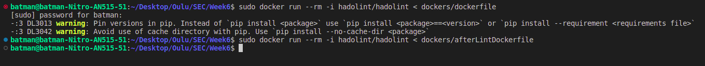
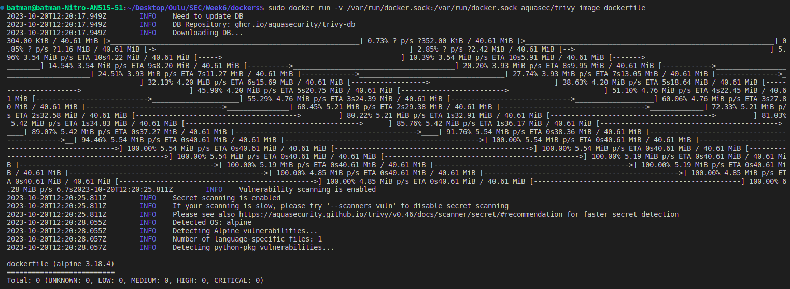
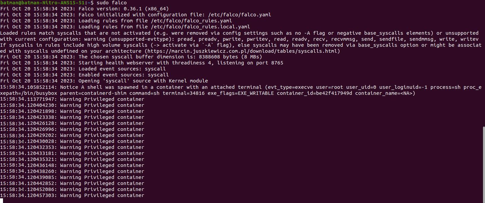

# Week 6

## Task 1: Secure Running Environment?

Task 1: Secure Running Environment?

**Container:**

Containers provide lightweight and isolated environments for applications, sharing the host OS kernel for efficiency. They offer processes and file system isolation, ensuring security for running applications. Containers can be also scanned for vulnerabilities and resource limits and/or access controls can be applied, enhancing their security. However, they share the host OS kernel, potentially exposing all containers to a kernel vulnerability. Containers can access host system resources directly, posing a risk if compromised.

**Virtualization:**

Virtualization creates isolated instances of OS and applications, ensuring strong isolation between virtual machines. VM runs on a hypervisor, providing complete independence from the host system. Each VM has its own OS, reducing the risk of vulnerabilities affecting others. They can be snapshotted for easy backups and recovery. However, VM are resource-intensive, slower to start, and have larger attack surfaces, making them susceptible to misconfigurations and potential exploits. Keeping VM images secure is vital, and their complexity can lead to security challenges.

## Task 2:

Refering to the example supply chain:

- Hardware

   - 3rd party company X manufactures antennas for the routers
   - Truck company Y transports them to
   - Factory Z, where it is assembled by workers
   - Y transports them to resellers A and B

- Software

   - Own employees create it
   - Company C provides contractual coders for help
   - Company D audits software
   - Company E hosts internal tools

### Potential Problems

1. Third-Party Suppliers: 
One of the primary concerns lies in the involvement of third-party suppliers, such as Company X manufacturing antennas. Ensuring their integrity is crucial to prevent tampering. A potential problem could be the lack of visibility into their security practices, which might necessitate additional scrutiny and audits.

2. Transportation and Storage: 
Transportation by Company Y and storage facilities pose significant risks. During transit or storage, products can be vulnerable to physical tampering or theft. Implementing secure packaging and utilizing trusted transportation partners is critical. However, challenges may arise in securing products during transit, requiring GPS tracking and real-time monitoring.

3. Software Development: 
In the realm of software, involving external entities like Company C, Company D, and Company E adds complexity. Malicious code injection or unauthorized access are potential threats. Utilizing [EDR](https://www.cisco.com/c/en/us/products/security/endpoint-security/what-is-endpoint-detection-response-edr-medr.html) solutions can help detect and respond to any suspicious activities. However, integrating these tools seamlessly might require tailored configurations and employee training.

### Possible Solutions

1. Supply Chain Audits: 
Regular audits of all actors in the supply chain, including third-party suppliers and transportation partners, should be conducted. This can ensure compliance with security standards and protocols. Engaging third-party auditors can provide an objective evaluation, enhancing transparency.

2. Secure Communication Channels: 
Implementing encrypted communication channels between all supply chain partners can safeguard data integrity. Secure protocols, such as VPNs and TLS, should be enforced. While this might require initial investment, the long-term benefits in data protection outweigh the costs.

3. Secure Software Development Lifecycle: 
Implementing a Secure Software Development Lifecycle (SSDL) is imperative. This involves code reviews, penetration testing, and adherence to industry best practices. Utilizing [UEBA](https://www.ibm.com/topics/ueba) tools can monitor employee behavior and detect anomalies, aiding in identifying potential insider threats.

4. Hardware Integrity Verification: 
Incorporating hardware integrity verification mechanisms, such as [TPM](https://support.microsoft.com/en-us/topic/what-is-tpm-705f241d-025d-4470-80c5-4feeb24fa1ee), ensures the authenticity of hardware components. This can prevent unauthorized modifications and tampering. However, ensuring compatibility between hardware and software might require close collaboration with suppliers and internal development teams.

### Improvements

1. Employee Training: 
Educating employees about security best practices and conducting regular training sessions can enhance awareness. Security awareness programs can empower employees to identify and report suspicious activities, adding an additional layer of defense.

2. Incident Response Plan: 
Developing a robust incident response plan is crucial. In the event of a security breach, having a well-defined protocol for investigation, containment, eradication, recovery, and post-incident analysis is essential. Regular drills and simulations can ensure the efficacy of the response plan.

3. Continuous Monitoring and Adaptation: 
Continuous monitoring of the supply chain and its actors is vital. Utilizing [NDR](https://www.cisco.com/c/en/us/products/security/what-is-network-detection-response.html) solutions enables real-time detection of threats, allowing for immediate response. Regularly reassessing the security landscape and adapting strategies based on emerging threats and technologies is essential for maintaining resilience.

## Task 3: Securing Docker
### Task 3A: Linting the Dockerfile

1. I used Hadolint
2. [DockerFile Before](dockers/dockerfile) --> [DockerFile After](dockers/afterLintDockerfile)
3.  

### Task 3B: Container Image Analysis

1. I used Trivy
2. [DockerFile for image](dockers/afterLintDockerfile)
3.  

### Task 3C: 

1. I used Falco
2. [DockerFile for image](dockers/afterLintDockerfile)
3.  
4.       sudo docker run --privileged -it dockerfile /bin/sh
