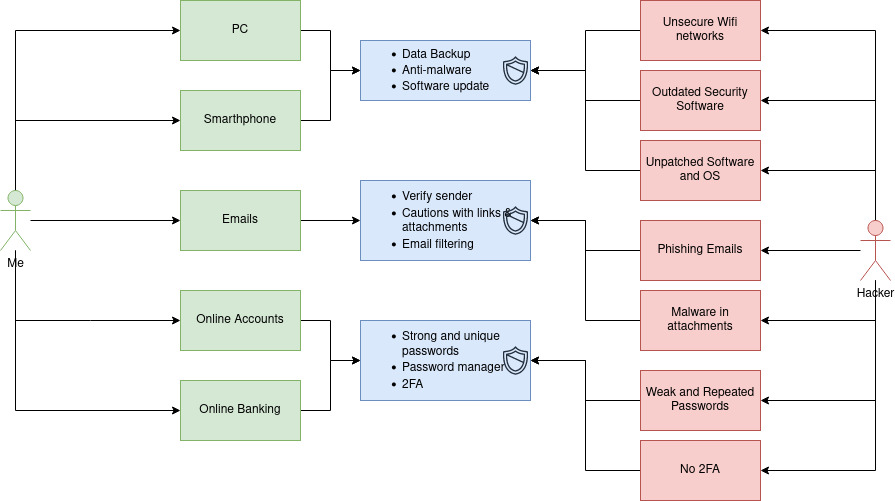
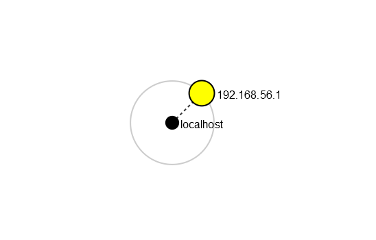
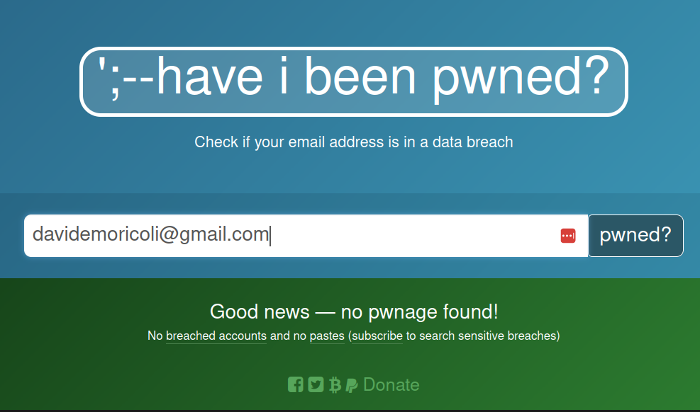
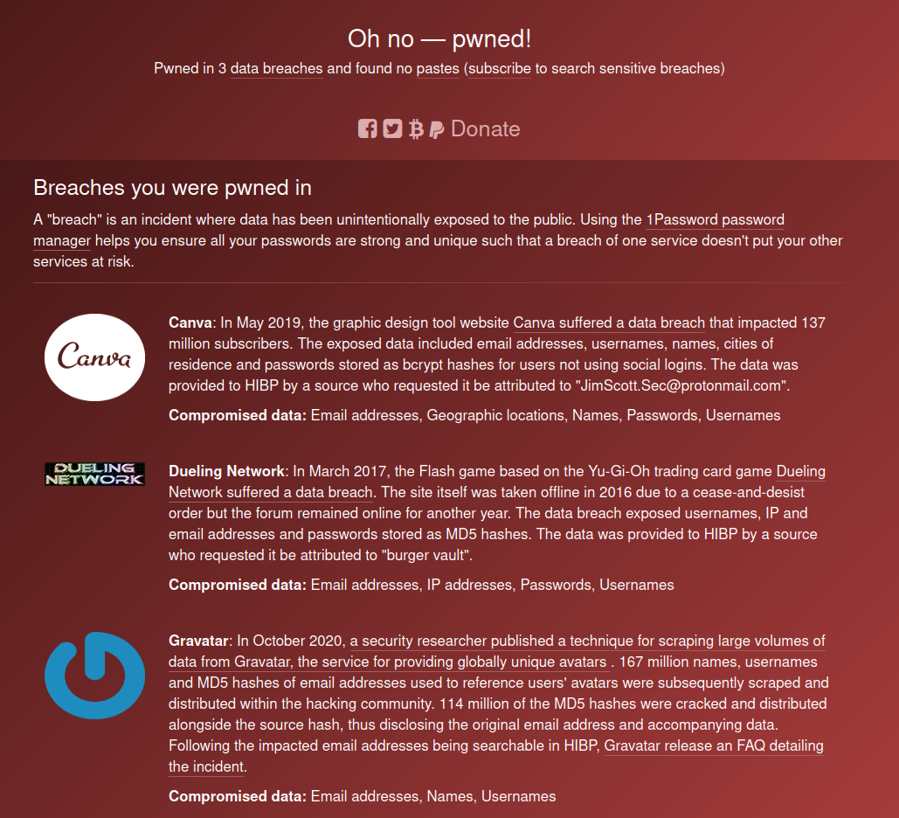
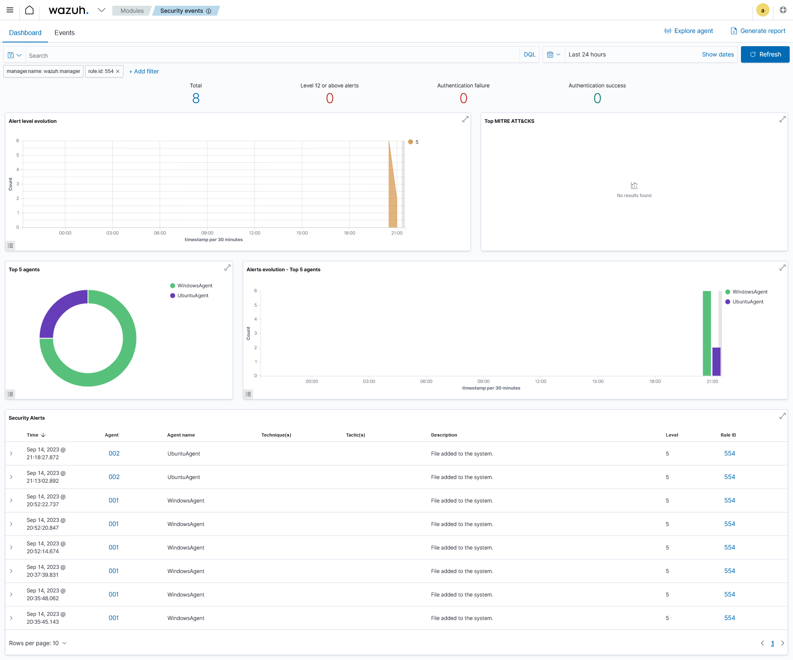
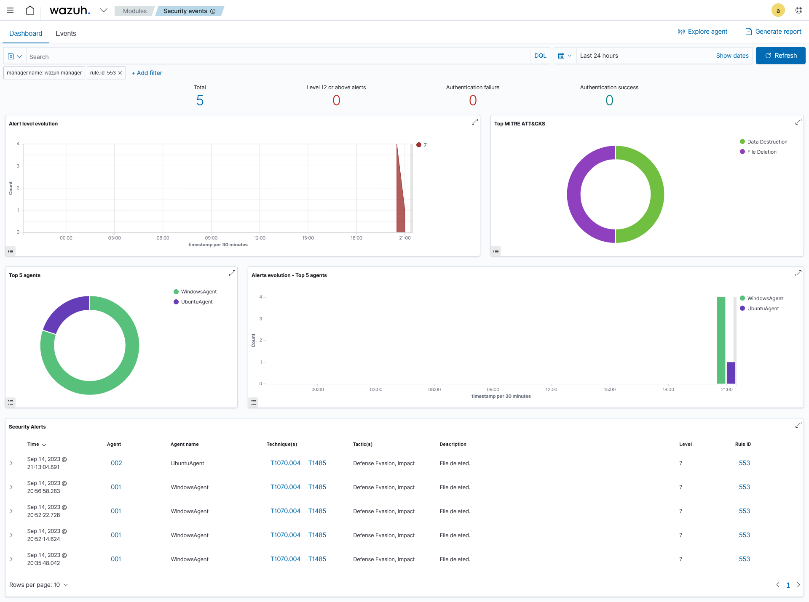
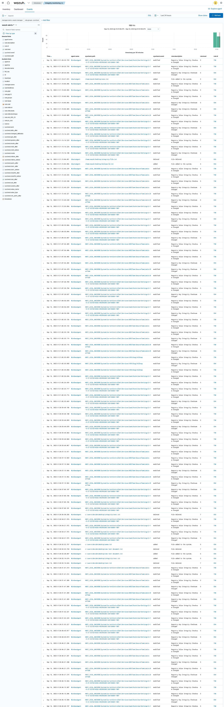

# Tasks

## Task 1: What measures have you taken to protect yourself from cyber crimes?

I have several accounts and e-mails to protect. For my personals things the only action that I have done is to choose different passwords for the more important and sensible accounts, such as bank account and all the accounts where I use my bank credentials or card credentials. I have also a passwords storage in LastPass but I know that some months ago it was hacked. They said that no sensible info were been taken by this hack.  
I will change my password storage and also I must change all the passwords, I already started to do this, only for the accounts that are most important for me.  
I haven't been a direct victim of cybercrimes, but I've encountered several phishing attempts in emails. In these cases, my vigilance have helped me avoid falling for phishing scams. I could enhance my cybersecurity awareness further and continue to stay updated on emerging threats.

## Task 2: Personal Threat Model

#### to create the image -> [drawio](https://www.drawio.com/)

## Task 3: Company Security Policy

#### Password policy

#### 1. Purpose
The purpose of this Security Password Policy is to establish guidelines for all the steps in passwords managing, starting with the creation and then protection, updates to ensure the security and the correct way for managing.

#### 2. Password Creation
Passwords must follows these complexity requirements:
- Minimum length of 12 characters
- Include a combination of uppercase and lowercase letters
- Include at least one numeric digit
- Include at least one special character (!, @, #, $, %, ^, &, *, etc...)
- Avoid using easily guessable information, such as names, birthdays, or common words

#### 3. Password Management
##### 3.1. Password Changes
Employees must change their passwords at least every 90 days.
These are the rules for the new passwords:
 - Passwords cannot be reused. 
 - Passwords cannot have the same six initial digit as the previous one.
 - New passwords must be follow [Password Creation](#password-creation)

##### 3.2. Password Sharing
Passwords *must* not be shared with anyone, including friends, superiors, IT technicians, etc...

##### 3.3. Password Storage
Not write down passwords on physical or digital media that are not securely stored. Use password manager instead.

##### 3.4. Password Recovery
For password recovery option theese are the options:
 - Personal Security Questions (at least 2) such as your dog's name, your first car, etc...
 - Alternate Email addresses.
 - Phone Number. 

#### 4. Multi-Factor Authentication (MFA)
Enable MFA.
MFA adds an extra procedure during the authentication level. It require at least 2 authentication factors such as something you know (password) and something you have (token or smartphone). 
[*IMPORTANT THING TO KNOW* (link)](https://support.microsoft.com/en-us/topic/what-is-multifactor-authentication-e5e39437-121c-be60-d123-eda06bddf661)  
'...You won't have to do the second step very often. Some people worry that multifactor authentication is going to be really inconvenient, but generally it's only used the first time you sign into an app or device, or the first time you sign in after changing your password. After that you'll just need your primary factor, usually a password, like you do now.' 

---

#### Social media security policy

#### 1. Purpose

This Social Media Security Policy outlines the guidelines and best practices for the responsible and secure use of social media by employees. Social media platforms offer numerous opportunities for communication, collaboration, and brand promotion, but they also pose potential risks to organization reputation and sensitive information. This policy aims to ensure that our employees engage in safe and responsible social media usage while representing our company online.

#### 2. Policy Statement

##### 2.1. Account Management
 - Personal social media accounts should not be used for business purposes.
 - All official social media accounts will be managed by the designated Social Media Manager or team.
 - All employees who engage in social media activities must use official, company-sanctioned accounts and profiles when posting company-related content.

#### 2.2. Confidentiality and Privacy
 - Do not public any confidential or proprietary information on social media platforms. This includes but is not limited to financial data, customer information, intellectual property, and sensitive internal discussions.
 - Respect the privacy of colleagues, clients, and partners. Do not share personal information about individuals without their consent.

#### 2.3. Content Guidelines
 - Ensure that all content posted on official company accounts aligns with values, brand guidelines, and professional standards. Avoid content that could be considered offensive, discriminatory.
 - Be mindful of the tone and language used in social media communications. Maintain a professional and respectful demeanor in all interactions.

#### 2.4. Cybersecurity
 - Be cautious of phishing attempts and malicious links shared on social media. Do not click on suspicious links.
 - Use strong, unique passwords for all company-related social media accounts and enable two-factor authentication when available. [Password Creation](#password-creation)
 - Regularly review and update your privacy settings on personal social media accounts to minimize potential risks.
 - Enable multi-factor authentication (MFA) whenever possible for added security.

## Task 4: Security Audit

### Task 4A: Network scan 
#### Did you find devices you did not know were in your network?
No, I didn't find any devices unknowed. I did the scan in the mobile routing network and I found only my devices.
#### Were there open ports which should have been closed?
<table>
<tr><th>PORT</th><th>STATE</th><th>SERVICE</th><th>VERSION</th></tr>
<tr><td>135/tcp</td><td>open</td><td>msrpc</td><td>Microsoft Windows RPC</td></tr>
<tr><td>139/tcp</td><td>open</td><td>netbios-ssn</td><td>Microsoft Windows netbios-ssn</td></tr>
<tr><td>5357/tcp</td><td>open</td><td>http</td><td>Microsoft HTTPAPI httpd 2.0 (SSDP/UPnP)</td></tr>
<tr><td>12345/tcp</td><td>open</td><td>netbus?</td><td></td></tr>
</table>
I know that I have to close the 12345 port. 

#### Did nmap find any vulnerabilities with the scripts?
I didn't find any vulnerabilities in the scripts.

#### Screenshot of the topology of your network. You can redact device information if you want.

### Task 4B: Account Security
#### Has your account details leaked? Screenshot of both haveibeenpwned search and spiderfoot search, you can redact information if you want.

I've tried with my 2 most used accounts.
I use ace625@outlook.it for the useless things such as videogames, images/videos stock websites, random websites, gym subscription etc...
and davidemoricoli@gmail.com for my important things such as work email, contact email, etc...
These are the results:

#### davidemoricoli@gmail.com

#### ace625@outlook.it

#### Did you change passwords that were leaked, if not, do it.
I didn't change passwords and emails and I don't think I will because all of these leaks were before my actual subscriptions.

### Task 4C: [Wazuh](https://www.wazuh.com)

#### What rule descriptions did you get?

I got "File added to the system" when I added some files, "File deleted" when I deleted some files and nothing when I added/deleted some directories.

#### What are the MITRE ATT&CK techniques(include ID) Wazuh reports for these events?

For the rule 554(File added to the system) the report shows no MITRE ATT&Ck techniques

#### What is the reported MITRE techniques for deleting files or directories inside monitored directories?

For the rule 553(File deleted) the report shows:
 - Defense Evasion (T1070.004)
 - Impact (T1485)

#### Explain in your own words where, when and why should these systems be used.
These systems could be used in big organizations when it is necessary to monitor users activity, have a fast incident response, do quickly threat detection and have a log management for all of these actions.
They should be used because they offer a simply and fast way to track a lot of useful information in an organized and optimal way, automating also the security monitoring and response.

#### Add a screenshot of your integrity monitoring events tab.
